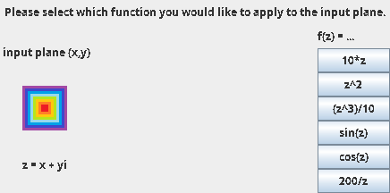
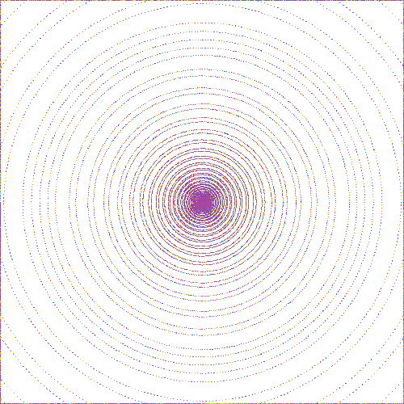

# Complex Functions Visualiser
A program written in Java to visualise complex functions, using custom graphic images. 

## The idea behind
Let $z$ be a complex number, such that:
$$z = x + iy$$
and let $f$ be any complex function:
$$f: \mathbb{C} \rightarrow \mathbb{C}$$
Then, let $f(z)$ be denoted by $z'$, whereas:
$$z' = x' + iy'$$
 
We may think of the function $f$ as a transformation in a complex plane, which moves any given point $(x,y)$ to $(x',y')$.

In this program, each pixel of a given input image will be treated as a point of coordinates $(x,y)$, and all transformed pixels will form the output image.

## Interface
Just click on the function you want to apply to the image.
 

 
Of course, you can always change the [input image](src/Input.png).
 
<i>(The one chosen is relatively small: 50x50, in order for the program to work quickly.)</i>

## Transformed images
| Function | Output |
|------------|------------|
| $f(z) = 10 z$  |   |
| $f(z) = z^2$  |   |
| $f(z) = \frac{1}{10} z^3$  |   |
| $f(z) = sin(z)$  |   |
| $f(z) = cos(z)$  |   |
| $f(z) = 200 z^{-1}$  |   |
